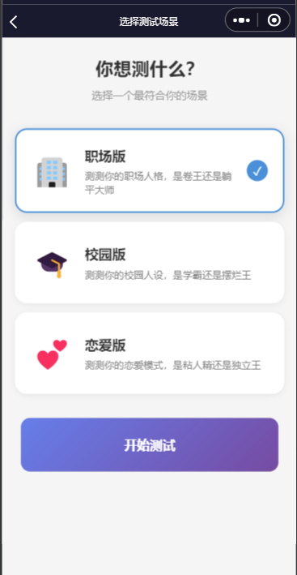
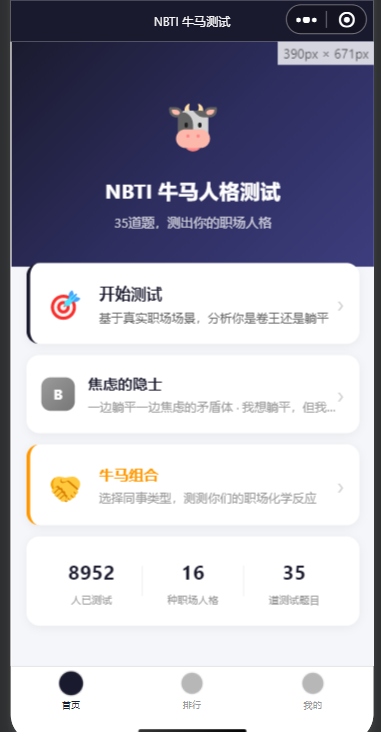

# NBTI 牛马人格测试

一款基于四维度人格模型的微信小程序，用 35 道题测出你的职场/校园/恋爱人格。

---

## 功能亮点

| 功能 | 说明 |
|------|------|
| 多场景人格测试 | 职场/校园/恋爱三套皮肤，共用一套四维度算法 |
| 16 种人格类型 | 基于能量(M/D)、行动(P/R)、心态(J/T)、表达(F/L)四维度 |
| 牛马组合 | 选择同事/同学/恋人类型，生成你们的化学反应分析 |
| 图鉴系统 | 解锁并收藏全部 16 种人格，查看六维属性雷达图 |
| 测试历史 | 保存每次测试结果，随时回顾人格变化 |

---

## 四维度模型

| 维度 | 左端 | 右端 | 含义 |
|------|------|------|------|
| 能量(M/D) | 社牛(M) | 社恐(D) | 能量来源：社交 vs 独处 |
| 行动(P/R) | 冲刺(P) | 摸鱼(R) | 做事方式：计划 vs 随性 |
| 心态(J/T) | 卷王(J) | 躺平(T) | 态度倾向：进取 vs 佛系 |
| 表达(F/L) | 表现(F) | 沉默(L) | 表达风格：外放 vs 内敛 |

---

## 项目结构

`
miniprogram/
├── pages/
│   ├── index/        # 首页
│   ├── skin/         # 皮肤选择（职场/校园/恋爱）
│   ├── test/         # 测试页面
│   ├── result/       # 结果展示
│   ├── combination/  # 牛马组合
│   ├── collection/   # 图鉴系统
│   ├── profile/      # 个人中心
│   └── ranking/      # 排行榜
├── data/
│   ├── characters/   # 三套皮肤的人格数据
│   ├── questions/    # 三套皮肤的题库
│   └── skins.js      # 皮肤元数据
└── utils/
    └── quiz-engine.js # 计分引擎
`

---

## 截图

### 皮肤选择

### 首页

---

## 开发

`ash
# 克隆项目
git clone <repo-url>

# 用微信开发者工具打开项目目录
# 填入你的小程序 AppID
# 点击编译即可预览
`

---

## 技术栈

- 原生微信小程序
- 微信 Canvas 2D API（雷达图绘制）
- 本地 Storage（测试历史、图鉴解锁状态）

---

## 开源协议

MIT
